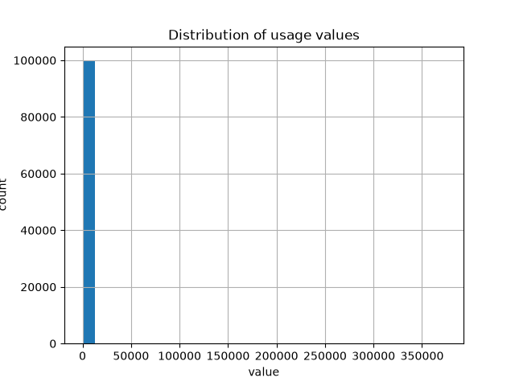
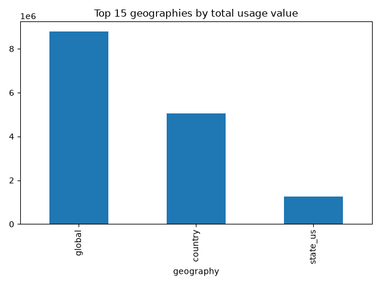

Caption: Most usage Values cluster near [X]; a long tail exists toward higher values, suggesting a small number og geography/task combinations dominate usage. 

Caption: [State/country] lead in raw usage volume, consistent with [population/GOP size] = this motivates normalizing population in later analysis.