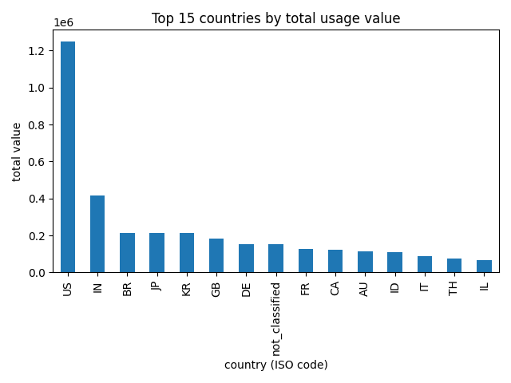
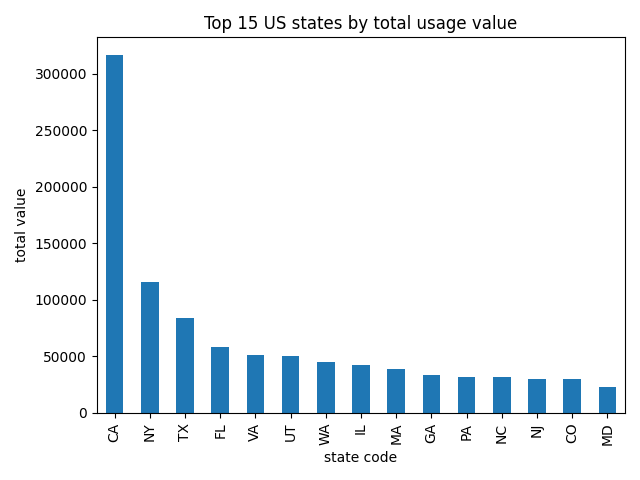
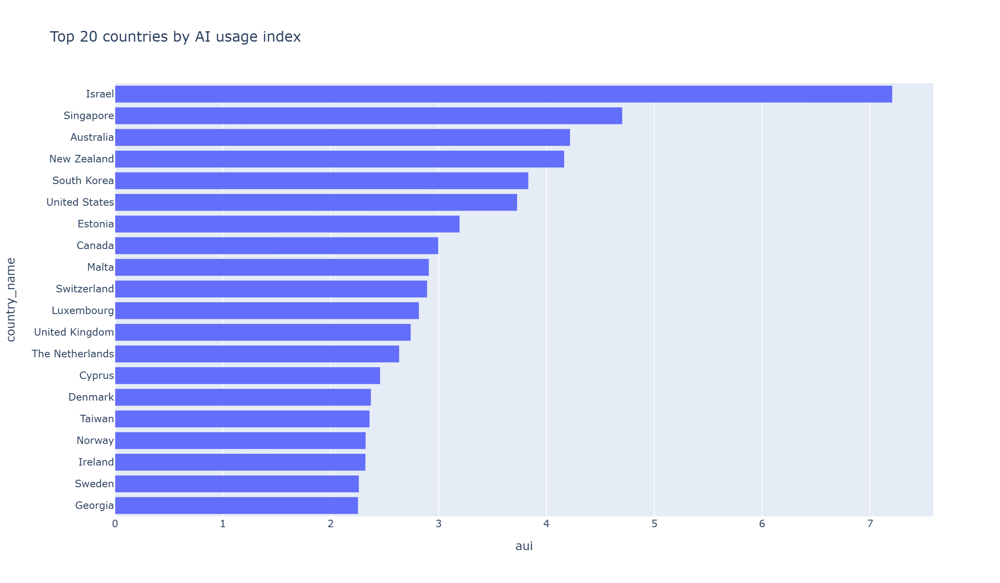
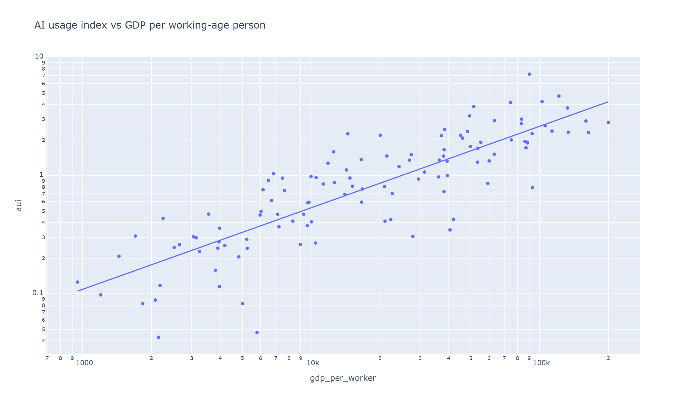
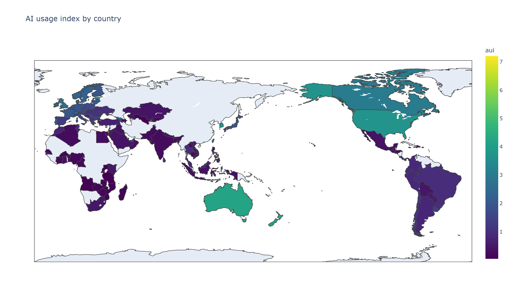
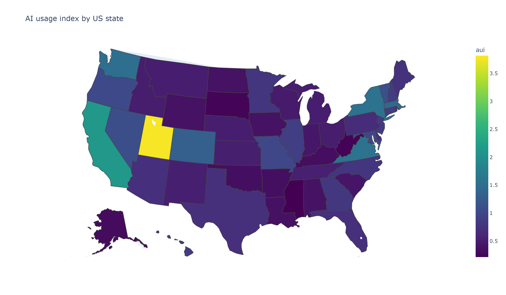

Caption: Most usage values are small: the median is 18 and 87% of rows are 100 or less. A long tail reaches into the hundreds of thousands, and the top 1% of rows account for over half of all value, suggesting a small number of geography and task combinations dominate usage.

Caption: The United States leads in raw usage volume with 208,200 conversations, followed by India (68,964) and Brazil (35,482), consistent with the size of their populations and economies. This motivates normalizing by working-age population in later analysis.

Caption: California leads in raw usage volume among US states with 52,617 conversations, about a quarter of the total, consistent with it being the most populous state. New York ranks second despite being fourth in working-age population, which motivates normalizing by population in later analysis.

Caption: After adjusting for working-age population, small, technologically advanced countries lead: Israel (7.2), Singapore (4.7), Australia (4.2), New Zealand (4.2) and South Korea (3.8). The United States drops to sixth at 3.7.

Caption: Usage index rises with GDP per working-age person. The log-log slope is about 0.69, so a 1% higher GDP per working-age person goes with roughly 0.7% higher usage, matching the relationship Anthropic reports.

Caption: Adoption is concentrated in high-income countries, while large emerging markets sit well below parity: Indonesia (0.37), India (0.27) and Nigeria (0.21). Only the 114 countries with at least 200 conversations are shown.

Caption: DC (3.82) and Utah (3.78) have the highest usage relative to working-age population, followed by California (2.13). Only 11 of 51 states and DC are above 1, and Mississippi (0.21) is lowest.